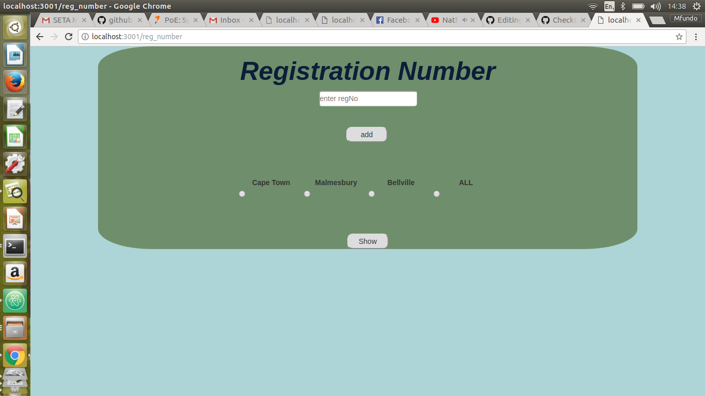

# registration_numbers_webapp

## ABOUT APPLICATION

This application allow user to enter car registrations of all towns that are in the Western Cape, then a user get to store all the data in the database called mongoDB and after entering the registration numbers , user has an option to view all registration from the same town (there is a filtering option by  town).

## APP NAME

- registration_numbers_webapp

## INSTALLATIONS

The first thing before getting started with the installations the user needs to go, to my github account and the following link will take you straight.

- [My GithubAccount](https://github.com/vivo8934)
- npm install (for node_modules)
- Go to the repositories and Select registration_numbers_webapp or just following this link if you find that hard
[registration](https://github.com/vivo8934/registration_numbers_webapp)
- fork the registration_numbers_webapp or clone it using this command on terminal (git clone https://github.com/vivo8934/registration_numbers_webapp.git)
- When you have the folder on your machine open it, go to the package.json.
- install all the dependencies using the following command:
eg for body-parser (npm install body-parser).

## KNOWN ISSUES

the Installation manuals written here in this readMe file are straight forward for linux operating sytems
so you might get errors and issues when using different operating systems,
- [windows](https://help.github.com/desktop/guides/contributing-to-projects/cloning-a-repository-from-github-desktop/#platform-windows)
- [Mac](https://help.github.com/desktop/guides/contributing-to-projects/cloning-a-repository-from-github-desktop/#platform-mac)

## CONTRIBUTIONS

- Create an issue and describe your idea
- [ForkIt](https://github.com/vivo8934/registration_numbers_webapp.git)
- Create your feature branch (git checkout -b my-new-feature)
- Commit your changes (git commit -am 'Add some feature')
- Publish the branch (git push origin my-new-feature)
- Create a new Pull Request
- Done

## USAGE

To run the app locally you need to make sure that you have install all the dependencies and nodemon , then open terminal
- open then folder which the registration_numbers_webapp is on.
- type command nodemon the you will have this screen

[nodemon] 1.11.0
[nodemon] to restart at any time, enter `rs`
[nodemon] watching: *.*
[nodemon] starting `node index.js`
`open()` is deprecated in mongoose >= 4.11.0, use `openUri()` instead, or set the `useMongoClient` option if using `connect()` or `createConnection()`. See http://mongoosejs.com/docs/connections.html#use-mongo-client
express-session deprecated undefined resave option; provide resave option index.js:24:9
express-session deprecated undefined saveUninitialized option; provide saveUninitialized option index.js:24:9

- then open the browser and enter the  localhost:3001/reg_number

- after entering registration number you can view them on the database using the following command:

1 mongo
2 show dbs
3 use registrations
3 db.regisnumbers.find({})

##  TEST 

- All the test here are being done true travic and mocha

## License: [CC-BY](https://creativecommons.org/licenses/by/3.0/)
